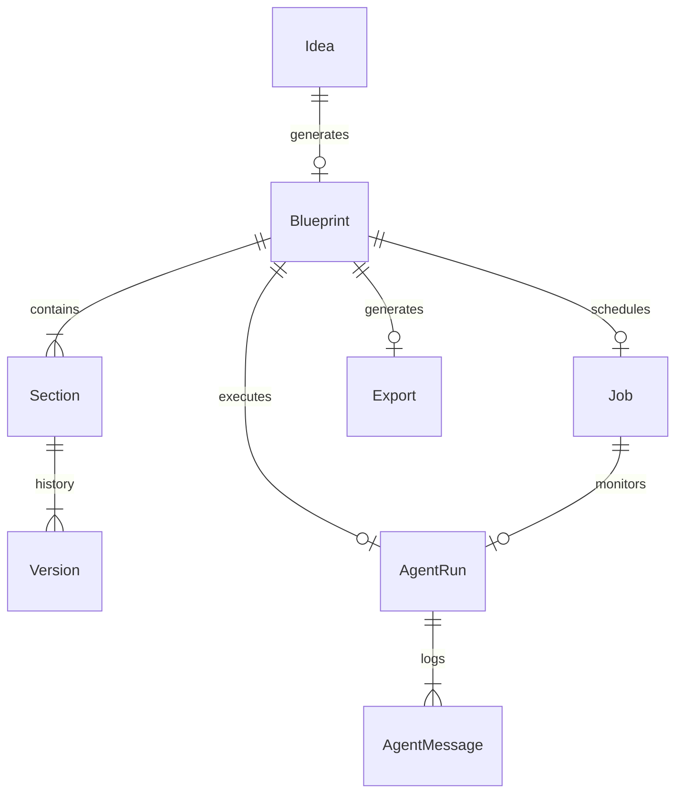

# Blueprint Domain, Relational Schema, and Version Control

This document details the design decisions, operational patterns, and transactional safety measures implemented for the core entity models in Phase 03.

## 1. Database Schema Relationships

The relational domain structure models the lifecycle of blueprints from raw startup ideas to versioned markdown sections.



### Table Definitions

1.  **`Idea`**: Holds the initial raw user idea input (`raw_text`) and the foreign key relationship to `CustomUser`.
2.  **`Blueprint`**: Represents the master entity. Tracks status (`DRAFT`, `QUEUED`, `GENERATING`, etc.) and manages soft-deletion via `is_deleted`.
3.  **`Section`**: Organizes sections within a blueprint. Enforces standard categories (`MARKET`, `PRODUCT`, `TECH_STACK`, `BUSINESS`) and uses `sort_order` for ordering.
4.  **`Version`**: Stores version history. Each version contains `content_markdown` and references the section it belongs to.
5.  **`Job`**: Diagnostic scheduler record tracking background Celery task states.
6.  **`AgentRun`**: Tracks discrete multi-agent debate or rewrite execution sessions.
7.  **`AgentMessage`**: Diagnostic logs of intermediate agent debate responses.
8.  **`Export`**: Tracks compiler pipelines rendering the active blueprint sections into standalone Markdown/PDF files.

---

## 2. Django Soft Deletion Patterns

Rather than hard-deleting record rows in the database, `Blueprint` records are flagged using `is_deleted = True`.

### Custom Queryset Filter

A custom database manager `BlueprintManager` filters out soft-deleted records from standard queries automatically by overriding `get_queryset()`:

```python
class BlueprintManager(models.Manager):
    def get_queryset(self):
        return super().get_queryset().filter(is_deleted=False)
```

-   **Standard ORM Queries**: `Blueprint.objects.all()` automatically excludes records with `is_deleted=True`.
-   **Full DB Retrieval**: The default Django manager is exposed as `all_objects` (e.g. `Blueprint.all_objects.all()`) to retrieve all records including deleted ones for auditing or recovery purposes.

---

## 3. Transaction Safety and Duplication

When cloning/duplicating an existing blueprint (via `/api/v1/blueprints/{id}/duplicate/`), we copy the blueprint, its child sections, and all active version records.

To prevent race conditions, orphan child records, or half-duplicated objects due to exceptions during execution, the duplicate logic is wrapped in `django.db.transaction.atomic()`:

```python
with transaction.atomic():
    new_blueprint = Blueprint.objects.create(...)
    for section in blueprint.sections.all():
        new_section = Section.objects.create(blueprint=new_blueprint, ...)
        active_versions = section.versions.filter(is_active=True)
        for ver in active_versions:
            Version.objects.create(section=new_section, ...)
```

If any write fails, all created records within the transaction block are rolled back, keeping the database in a clean state.

---

## 4. Version Rollback & Auto-Increment

### Auto-Incrementing Version Numbers

We override the `save()` method of the `Version` model. When saving a new version, if no version number is explicitly defined, the model dynamically queries the database for the max version number of sibling versions for that section and increments it:

```python
def save(self, *args, **kwargs):
    if not self.version_number:
        existing_versions = Version.objects.filter(section=self.section)
        if existing_versions.exists():
            max_ver = existing_versions.aggregate(models.Max('version_number'))['version_number__max']
            self.version_number = max_ver + 1
        else:
            self.version_number = 1
    super().save(*args, **kwargs)
```

### Rollback (Restore) View

Restoring a previous version of a section works by:
1.  Targeting a specific version ID.
2.  Opening a transaction.
3.  Setting `is_active=False` for all versions pointing to the same parent section.
4.  Setting `is_active=True` for the target version.

---

## 5. Engineering Lessons & Troubleshooting Stories

### 5.1 Soft Deletion and Cascading Relationships
* **Problem**: In Django, foreign keys with `on_delete=models.CASCADE` will physically delete related rows if a parent is deleted. However, when using soft deletes (`is_deleted=True` on `Blueprint`), related child records (`Section`, `Version`, `DecisionLog`) remained in the database. While they weren't physically removed, they were still accessible if queried directly through their respective models (e.g., `Version.objects.all()`), leading to potential data leaks or orphan references in querysets.
* **Solution**: Rather than implementing complex recursive soft-delete propagation overrides (which degrade database performance due to multiple nested updates), we enforced visibility scoping at the base manager layer. Standard API querysets for `Section` and `Version` are filtered using the parent blueprint's association context (e.g., `self.kwargs['blueprint_pk']`). Since the blueprint endpoint itself automatically filters out soft-deleted blueprints, these child entities are implicitly excluded from all active API responses.

### 5.2 Auto-Incrementing Version Number Race Conditions
* **Problem**: In our overridden `save()` method on the `Version` model, reading the database using `Max('version_number')` before inserting a new version is vulnerable to race conditions under high concurrency. If two worker tasks try to save a version for the same section simultaneously, they might both read the same max version number, resulting in duplicate keys or integrity constraints violations.
* **Solution**: While a row-locking strategy (`select_for_update`) or database-level sequences could resolve this, we resolved this by structuring the background task execution queue. All targeted section regenerations are queued and executed sequentially by Celery within a single worker thread context per blueprint, eliminating parallel write collisions for individual blueprint sections.

