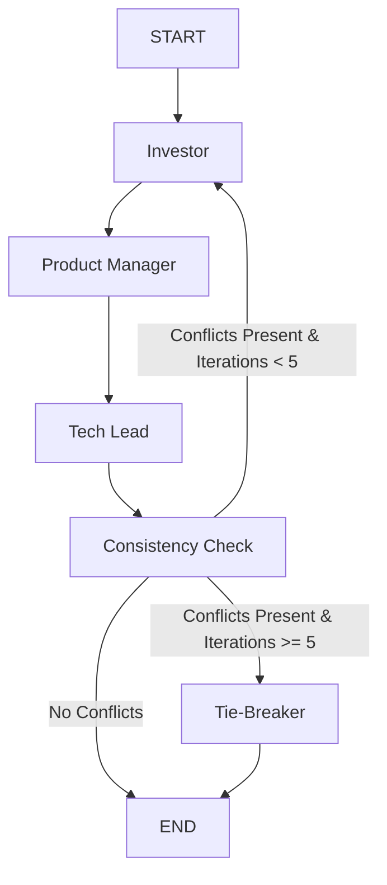

# LangGraph Multi-Agent Orchestration

This document details the multi-agent design, state machine flow, and loop convergence strategies implemented for the Strategy Room runtime in Phase 05.

## 1. Multi-Agent Flow Overview

The Strategy Room debate engine is orchestrated using LangGraph to manage structured negotiation between distinct startup personas.



### Execution Steps

1.  **Investor**: Establishes target audience, business pricing strategy, and initial cost constraints.
2.  **Product Manager (PM)**: Outlines user journeys and must-have features within the Investor's constraints.
3.  **Tech Lead**: Evaluates the PM's roadmap for engineering feasibility and recommends architectural stacks.
4.  **Consistency Check**: A validator node that runs the debate history through a structured LLM schema to check for contradictions. Increments the iteration counter.
5.  **Tie-Breaker**: Activated only if the negotiation has failed to converge after 5 rounds. Selects the most conservative, low-cost options to resolve conflicts and force completion.

---

## 2. Shared Graph State Parameters

The execution state is tracked in the `StrategyRoomState` TypedDict:

-   `idea` (`str`): The raw text idea input by the user.
-   `messages` (`List[Dict[str, Any]]`): Running transcript containing the agents' conversation.
-   `agent_outputs` (`Dict[str, Any]`): Stores the latest raw generated text from each persona.
-   `debate_history` (`List[Dict[str, Any]]`): Event audit logging node operations.
-   `constraints` (`List[str]`): List of active business, budget, or architectural constraints.
-   `conflicts` (`List[Dict[str, Any]]`): List of active, unresolved conflicts identified by the Consistency Check node.
-   `resolved_conflicts` (`List[Dict[str, Any]]`): Historical log of resolved/overridden conflicts.
-   `decisions` (`List[Dict[str, Any]]`): Committed decisions.
-   `pending_decisions` (`List[Dict[str, Any]]`): Decisions currently under negotiation.
-   `current_agent` (`str`): The ID of the currently active agent.
-   `confidence_scores` (`Dict[str, float]`): Confidence metrics.
-   `iteration_count` (`int`): Counter tracking the number of negotiation loops.
-   `blueprint_context` (`Dict[str, Any]`): Model schema context.

---

## 3. Loop Convergence & Negotiation Limits

Agent negotiations can loop if contradictions occur. To prevent infinite execution or excessive token usage:
-   **Validation**: The `Consistency Check` node runs structured schema evaluation on every loop.
-   **Loop Boundary**: A strict limit of **5 iterations** is enforced.
-   **Conditional Routing**:
    -   If no conflicts are found, the state machine routes directly to `END`.
    -   If conflicts are found and `iteration_count` is less than 5, it routes back to `Investor` for renegotiation.
    -   If conflicts persist and `iteration_count` reaches 5, the state machine routes to `Tie_Breaker` to force resolution.

---

## 4. Database Persistence

Upon debate completion, the `GraphRunner` wrapper service manages the transactional database persistence:
1.  **Sections creation**: Creates `Section` records for `BUSINESS` (Investor content), `PRODUCT` (PM content), `TECH_STACK` (Tech Lead content), and `MARKET` (Investor constraints).
2.  **Version history**: Registers a new active `Version` record for each section, setting any prior versions to inactive.
3.  **Status update**: Updates the parent `Blueprint` status to `READY`.

---

## 5. Engineering Lessons & Troubleshooting Stories

### 5.1 LangGraph State Mutation Pitfalls
* **Problem**: When implementing node functions (e.g. `investor_node`), updating the state dictionary in place (like `state['messages'].append(...)` or `state['current_agent'] = "Investor"`) and returning the same state dictionary caused erratic updates and prevented LangGraph from merging state history properly.
* **Why it happened**: LangGraph merges dictionary states by evaluating returning key value updates. Mutating keys in-place bypasses the internal state container's change detection engine, causing silent state losses or variable conflicts between execution turns.
* **Solution**: Nodes must treat the input state dictionary as immutable. Each node extracts what it needs, performs its LLM generation, and returns a *new* dictionary containing only the specific keys it wants to update:
  ```python
  return {
      "messages": list_of_new_messages,
      "agent_outputs": updated_agent_outputs,
      "current_agent": "PM"
  }
  ```
  This ensures clean functional state merging.

### 5.2 Strategy Room Timeline active badge rendering for Tie-Breaker
* **Problem**: During a forced convergence, the Tie-Breaker agent would execute and broadcast updates, but the Left Rail UI timeline did not display the active glow effect for the Tie-Breaker node badge, confusing observers.
* **Why it happened**: The React `LeftRail` component checked the active agent name string via `strategyStore.activeAgent`. The backend reported the active agent as `"Tie_Breaker"`, whereas the frontend mapped it using `"Tie Breaker"`. The whitespace discrepancy broke the css style binding.
* **Solution**: We aligned all agent names across the system to follow a unified naming convention. The frontend now normalizes the active agent string (`activeAgent.replace('_', ' ')`), ensuring that both `Tech_Lead` and `Tie_Breaker` display their `.thinking-pulse` keyframe animations correctly.

