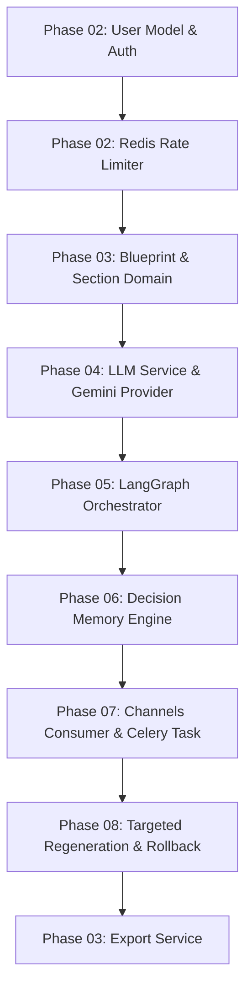
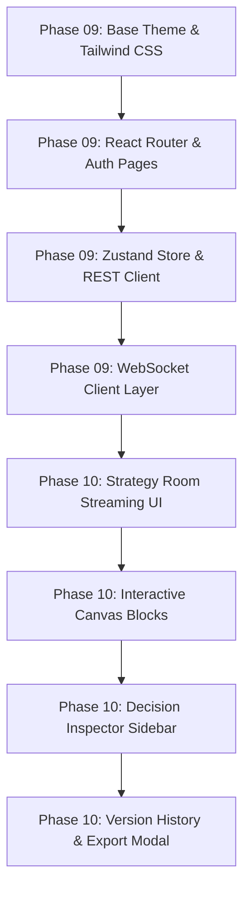
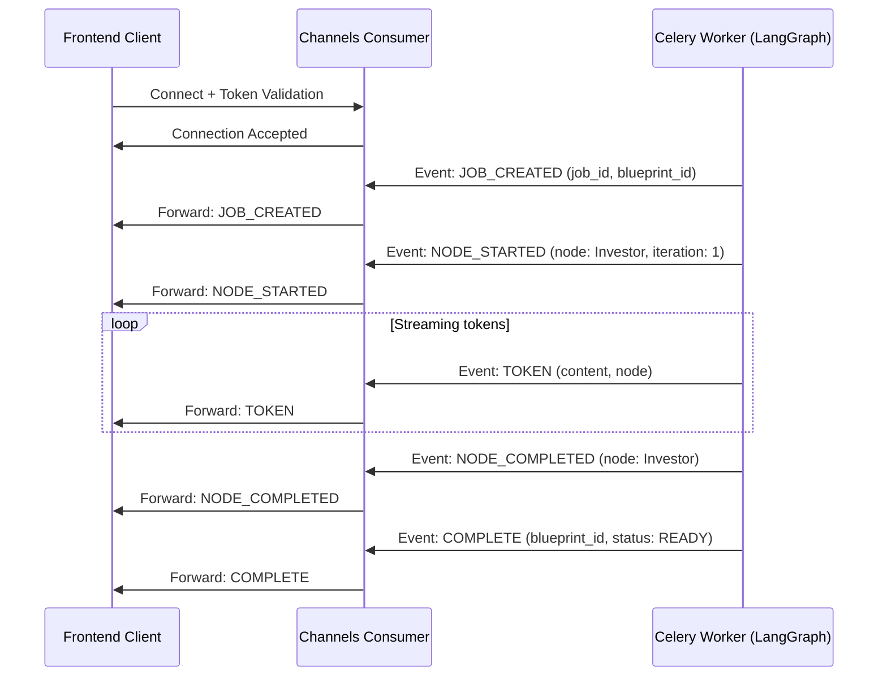

# Foundry — Implementation Roadmap Index

This document serves as the master catalog, architectural map, and sequence index for implementing **Foundry** (Smart Start-up Blueprint Generator). Foundry is structured with two logically independent repositories: `backend/` (Django + Celery) and `frontend/` (React), which are connected only through REST and WebSocket contracts.

This index provides a comprehensive overview of the implementation sequence, module complexity, dependencies, cross-layer contracts, and milestone validations designed for a single developer working sequentially.

---

## 1. Document Index & Quick Links

Below are the direct links to the individual phase documents detailing the folder structures, class definitions, and atomic implementation tasks:

1. **[Phase 01: Project Setup](file:///d:/Coding/Projects----For%20Resume/Foundry/Docs/Roadmap/Phase_01_Project_Setup.md)** — Core project setup, Docker Compose, and dev environment verification.
2. **[Phase 02: Core Django Foundation](file:///d:/Coding/Projects----For%20Resume/Foundry/Docs/Roadmap/Phase_02_Core_Django_Foundation.md)** — Custom user model, rate limiting, and authentication.
3. **[Phase 03: Blueprint Domain & Versioning](file:///d:/Coding/Projects----For%20Resume/Foundry/Docs/Roadmap/Phase_03_Blueprint_Domain.md)** — Relational domain models (`Blueprint`, `Section`, `Version`, `Jobs`), API endpoints, and serialization.
4. **[Phase 04: LLM Adapter & Provider Abstraction](file:///d:/Coding/Projects----For%20Resume/Foundry/Docs/Roadmap/Phase_04_LLM_Service.md)** — `LLMService` and `GeminiProvider` implementations, validation schemas, and retry logic.
5. **[Phase 05: LangGraph Strategy Room Runtime](file:///d:/Coding/Projects----For%20Resume/Foundry/Docs/Roadmap/Phase_05_Strategy_Room_Runtime.md)** — Strategy Room state machine, debate turn-taking nodes, convergence check, and tie-breaking.
6. **[Phase 06: Decision Memory Engine](file:///d:/Coding/Projects----For%20Resume/Foundry/Docs/Roadmap/Phase_06_Decision_Memory_Engine.md)** — Structured Decision Log database mapping, Decision Graph edges, extraction logic, context injection, and conflict detection.
7. **[Phase 07: Real-Time Streaming & Channels](file:///d:/Coding/Projects----For%20Resume/Foundry/Docs/Roadmap/Phase_07_Streaming_Runtime.md)** — Channels consumers, WebSocket protocol handshake, event publishing, and Celery background task wiring.
8. **[Phase 08: Targeted Regeneration & Rollback](file:///d:/Coding/Projects----For%20Resume/Foundry/Docs/Roadmap/Phase_08_Regeneration_Workflow.md)** — Section-aware partial debate execution, dependency analysis, version restoration, and decision state rollback.
9. **[Phase 09: React Frontend — Architecture & State](file:///d:/Coding/Projects----For%20Resume/Foundry/Docs/Roadmap/Phase_09_React_Frontend_Base.md)** — Frontend environment config, base theme, layout wireframe, Zustand global state, API, and WebSocket client layers.
10. **[Phase 10: React Frontend — Interactive Canvas & UI](file:///d:/Coding/Projects----For%20Resume/Foundry/Docs/Roadmap/Phase_10_React_Frontend_UI.md)** — Mission Control, Live Streaming panel, Interactive Document Canvas, Revision Sidebar, Decision Inspector, and Export UI.
11. **[Phase 11: Testing, Security & Learning Audit](file:///d:/Coding/Projects----For%20Resume/Foundry/Docs/Roadmap/Phase_11_Testing_Audit.md)** — End-to-end regression testing, validation checkpoints, usage rate-limiting audits, and `Docs/Learning/` deep-dive catalogs.

---

## 2. Architecture Review

Below is the list of architectural inconsistencies identified between the core design documents. The implementation roadmap highlights these inconsistencies but does not finalize or resolve them, as architectural decisions must be resolved in the source planning documents:

### Inconsistency 1: User Tiers and Rate Limiting
* **Inconsistency**: `PRD.md` and `Feature_List.md` specify user-tier usage rate limits, but the database schema in `DB_Schema.md` has no `tier` or metadata column on the `users` table.
* **Affected Documents**: [PRD.md](file:///d:/Coding/Projects----For%20Resume/Foundry/Docs/PRD.md), [Feature_List.md](file:///d:/Coding/Projects----For%20Resume/Foundry/Docs/Feature_List.md), [DB_Schema.md](file:///d:/Coding/Projects----For%20Resume/Foundry/Docs/DB_Schema.md)
* **Why Implementation is Blocked**: It is not possible to implement or store user tiers in the database or enforce tier-based rate limits without a designated field or extension in the custom user model.
* **Action Required**: An explicit architectural decision must be made in the planning documents to define the `tier` field schema and its default values in the user database model.

### Inconsistency 2: Decision Category Mismatches
* **Inconsistency**: `Decision_Memory_Architecture.md` lists a `category` column (`MARKET`, `PRODUCT`, `TECH_STACK`, `BUSINESS_MODEL`) on the `decision_log` table, but `DB_Schema.md` omits this column from the `decision_log` specification and uses `BUSINESS` instead of `BUSINESS_MODEL` on the `sections` category column.
* **Affected Documents**: [Decision_Memory_Architecture.md](file:///d:/Coding/Projects----For%20Resume/Foundry/Docs/Decision_Memory_Architecture.md), [DB_Schema.md](file:///d:/Coding/Projects----For%20Resume/Foundry/Docs/DB_Schema.md)
* **Why Implementation is Blocked**: The validation logic, Pydantic extraction schemas, and SQL schemas cannot be aligned without standardizing the categories across both decision logs and section records.
* **Action Required**: Align the category set in the source documents (`DB_Schema.md` vs. `Decision_Memory_Architecture.md`) to standard enum values.

### Inconsistency 3: Traceability Mappings
* **Inconsistency**: The `versions` table did not have a foreign key to track which Celery task or LangGraph run generated that text, despite the ERD showing a relation.
* **Affected Documents**: [DB_Schema.md](file:///d:/Coding/Projects----For%20Resume/Foundry/Docs/DB_Schema.md)
* **Why Implementation is Blocked**: Text updates cannot be linked to their generating background execution tasks or LangGraph runs, breaking generation traceability.
* **Action Required**: Add explicit foreign key definitions in the database schema documents to link the `versions` and `decision_log` tables back to `agent_runs` or `jobs`.

### Inconsistency 4: Relationship between Jobs and Agent Runs
* **Inconsistency**: The schema specifies both Celery `jobs` and LangGraph `agent_runs` but does not define the relationship cardinality or key constraints between them.
* **Affected Documents**: [DB_Schema.md](file:///d:/Coding/Projects----For%20Resume/Foundry/Docs/DB_Schema.md)
* **Why Implementation is Blocked**: Defining how Celery jobs schedule, track, and resume LangGraph executions requires knowing whether a job maps to one or multiple agent runs.
* **Action Required**: Define the relationship cardinality and key mapping between the `jobs` and `agent_runs` tables in the database schema.

---

## 3. Estimated Implementation Complexity per Module

The modules are evaluated below based on cognitive load, algorithmic density, and integration risk:

| Module / Subsystem | Primary Layer | Core Tech Stack | Estimated Complexity | Risk Profile |
| :--- | :--- | :--- | :--- | :--- |
| **User Identity & Rate Limiting** | Backend | Django DRF, Redis | Low | Low |
| **Blueprint CRUD & Serializers** | Backend | Django REST Framework | Low | Low |
| **LLM Provider Abstraction** | Backend / AI | Python, Gemini API | Medium | Low |
| **LangGraph Orchestrator** | AI Runtime | LangGraph, Celery | High | Medium |
| **Decision Memory Engine** | AI / DB | PostgreSQL, Pydantic | High | High |
| **Streaming WebSocket Server** | Channels | Django Channels, Redis | Medium | Medium |
| **Targeted Section Regeneration** | AI / Backend | Celery, SQL, LangGraph | High | High |
| **Global React Store & API Layers** | Frontend | Zustand, Axios, WS Client | Medium | Low |
| **Interactive Canvas & Inspector** | Frontend | React, TipTap, Tailwind | High | Medium |
| **Structured Export Module** | Backend | Markdown-to-PDF / WeasyPrint | Low | Low |

---

## 4. Internal Module Dependency Graphs

### Backend Dependency Flow

### Frontend Dependency Flow

---

## 5. Cross-Layer Contract Map

To keep the development layers decoupled, the frontend and backend communicate strictly through the contracts mapped below:

### REST API Route Contract
| Endpoint | Method | Request Payload | Response Payload | Frontend Trigger |
| :--- | :--- | :--- | :--- | :--- |
| `/api/v1/auth/register/` | `POST` | `{"email", "password", "name"}` | `{"token", "user"}` | Registration Submit |
| `/api/v1/auth/login/` | `POST` | `{"email", "password"}` | `{"token", "user"}` | Login Submit |
| `/api/v1/blueprints/` | `GET` | *(Query params: `?search=`)* | `List<BlueprintDetail>` | Dashboard list fetch |
| `/api/v1/blueprints/` | `POST` | `{"raw_text"}` (original idea) | `202: {"blueprint_id"}` | "Create Blueprint" trigger |
| `/api/v1/blueprints/{id}/` | `GET` | None | `BlueprintDetail` | Hydrate Canvas page |
| `/api/v1/blueprints/{id}/` | `DELETE` | None | `{"deleted": true}` | Delete blueprint |
| `/api/v1/sections/{id}/versions/` | `GET` | None | `List<VersionDetail>` | Show version history panel |
| `/api/v1/sections/{id}/regenerate/` | `POST` | `{"user_note", "enforce_previous_decisions"}` | `202: {"task_id"}` | Sidebar rewrite trigger |
| `/api/v1/decisions/blueprint/{id}/` | `GET` | None | `List<DecisionLogEntry>` | Populate Decision Sidebar |
| `/api/v1/decisions/{id}/override/` | `POST` | `{"choice_value", "rationale"}` | `200: DecisionLogEntry` | Force override check |
| `/api/v1/exports/{id}/trigger/` | `POST` | `{"format": "MARKDOWN"\|"PDF"}` | `202: {"export_url"}` | Export compilation trigger |
| `/api/v1/versions/{id}/restore/` | `POST` | None | `VersionDetail` | Restore historical section version |

### WebSocket Event Protocol (Channels ↔ Zustand Client)
All WebSocket communications stream over `ws://localhost:8000/ws/strategy/{blueprint_id}/?token=<token>`.

---

## 6. Implementation Milestones

The implementation roadmap guarantees that the repository remains stable, runnable, and testable at each milestone.

### Milestone 01: Core Web Foundation
* **Goal**: Establish project plumbing and REST services.
* **Completed Functionality**: Dockerized environments running PostgreSQL, Redis, Django, and React. User authentication API and standard blueprint listing and creation endpoints are fully implemented.
* **Demonstrable Behavior**: User can register, login, view their empty list of blueprints, and POST a raw idea string that returns a `202 Accepted` status code.
* **Testing Checkpoint**: Pytest suite for user model creation, rate limit interceptors, and blueprint database operations. 
* **Intentionally Incomplete**: No AI agents, No WebSocket connections, No UI editor canvas.

### Milestone 02: LLM Service & Basic State Machine
* **Goal**: Build LLM adapter layers and the offline multi-agent debate.
* **Completed Functionality**: `LLMService` API wrapping Gemini. Full LangGraph state definitions and turn-based transition logic executed inside a synchronous task framework.
* **Demonstrable Behavior**: Run a Django shell script that inputs an idea, runs the three agent nodes sequentially using real Gemini calls, performs convergence analysis, and saves the text sections to Postgres.
* **Testing Checkpoint**: Mocked LLM provider testing ensuring LangGraph state transitions from Investor → PM → Tech Lead → Consistency Check.
* **Intentionally Incomplete**: No real-time token streaming, no WebSocket protocol, React frontend lacks strategy debate UI.

### Milestone 03: Decision Memory and Streaming Runtime
* **Goal**: Enable consistency checks, Celery execution, and real-time streaming.
* **Completed Functionality**: The Decision Memory database log extraction and prompt injection. Celery tasks executing the graph concurrently. Channels consumers publishing debate status and tokens over WebSockets.
* **Demonstrable Behavior**: User submits an idea from the console, opens a WebSocket client tool (e.g. websocat), and watches the real-time `TOKEN` and `NODE_STARTED` JSON payloads stream until the `COMPLETE` event is fired.
* **Testing Checkpoint**: Integration testing of the "Consistency Join" query. WebSocket consumer connection validation and frame validation.
* **Intentionally Incomplete**: Targeted section regenerations, manual overrides, React canvas editing interface.

### Milestone 04: Section Regeneration and Overrides
* **Goal**: Complete backend capabilities for targeted updates.
* **Completed Functionality**: REST endpoints for section-specific regeneration, conflict checks, manual overrides, and version rollback triggers.
* **Demonstrable Behavior**: Submit a REST POST to regenerate a section with a contradictory note. The API returns a `422 Conflict` payload detailing the contradiction. Triggering with `enforce_previous_decisions=false` completes successfully, creating a new `Version` and updating `decision_log` relations.
* **Testing Checkpoint**: Integration tests for Decision Graph dependency propagation, override inserts, and version restoration.
* **Intentionally Incomplete**: React frontend UI (Zustand client integration).

### Milestone 05: Production-Ready Frontend Canvas & Strategy Room
* **Goal**: Assemble the client-side experience and run end-to-end.
* **Completed Functionality**: React UI dashboard, Strategy Room live streaming animation pane, Interactive Document Canvas, Revision Sidebar, and Decision Inspector.
* **Demonstrable Behavior**: Log in to React, type an idea, watch the three agents debate in real-time on a mission-control dashboard. Once complete, click on section blocks, inspect decision anchors, write edits in the sidebar, view conflicts, and export the blueprint to Markdown.
* **Testing Checkpoint**: End-to-end Cypress/Playwright integration tests executing a full debate cycle and a targeted section rewrite.
* **Intentionally Incomplete**: None (system is fully integrated and validated).

---

## 7. Suggested Epics & GitHub Issues Mapping

We suggest creating the following **Epics** and child **GitHub Issues** to guide sequential execution:

* **Epic 01: Setup & Core API** (Milestone 01)
  * Issue #1.1: Initialize project directory structures & configure Docker Compose services.
  * Issue #1.2: Implement Custom User Model, Tier Enums, and simple JWT authentication views.
  * Issue #1.3: Develop Redis-backed user/tier rate-limiting middleware.
  * Issue #1.4: Define `Blueprint`, `Section`, `Version`, and `Jobs` database models and migrations.
  * Issue #1.5: Create REST API endpoints for Blueprints and Sections lists and details.
* **Epic 02: Model Adapter & Strategy Room Graph** (Milestone 02)
  * Issue #2.1: Write base `LLMService` interface & create `GeminiProvider` implementation.
  * Issue #2.2: Implement structured JSON parsing, timeouts, and fallback retry wrappers.
  * Issue #2.3: Define LangGraph shared state schemas and node transition models.
  * Issue #2.4: Implement Investor, PM, and Tech Lead agent nodes with distinct instructions.
  * Issue #2.5: Implement Consistency Check convergence and tie-breaker nodes.
* **Epic 03: Decision Memory & Live WebSockets** (Milestone 03)
  * Issue #3.1: Create Decision Log extractor with structured JSON output (Pydantic).
  * Issue #3.2: Implement context retrieval queries and prompt injection formatter.
  * Issue #3.3: Set up Django Channels routing and WebSocket connection token middleware.
  * Issue #3.4: Develop Strategy Room WebSocket Consumer to publish streaming tokens.
  * Issue #3.5: Wrap LangGraph execution inside Celery background tasks.
* **Epic 04: Dynamic Editing & Section Regeneration** (Milestone 04)
  * Issue #4.1: Develop section-aware targeted debate runner.
  * Issue #4.2: Implement comparison-hash rules for automated conflict detection.
  * Issue #4.3: Implement Manual Override updates and decision superseding.
  * Issue #4.4: Add version restoration logic and decision rollback.
  * Issue #4.5: Implement export compiling service (Markdown to PDF/MD).
* **Epic 05: React Frontend Integration** (Milestone 05)
  * Issue #5.1: Scaffold React (Vite) app, install Tailwind CSS, and configure layout shells.
  * Issue #5.2: Create Zustand stores for auth, streaming debate, and canvas editing.
  * Issue #5.3: Develop Strategy Room "Observer Mode" interface (Streaming, Timeline).
  * Issue #5.4: Implement Interactive Document Canvas with block edits.
  * Issue #5.5: Create Decision Inspector popovers, Conflict Banners, and Export downloaders.
  * Issue #5.6: Conduct final testing, verification, and `Docs/Learning` audits.

---

## 8. Suggested Git Commit Boundaries

Maintain clean Git history by committing at logical progression points. Use the following structured boundaries:

1. `setup/project-plumbing`: Base structure, configurations, and Docker integration.
2. `feat/backend/auth-rates`: Custom users, migration scripts, JWT endpoints, and rate-limiting.
3. `feat/backend/domain-crud`: Blueprint models, migration scripts, and REST API controllers.
4. `feat/ai/llm-provider`: `LLMService`, `GeminiProvider`, and structured schema tests.
5. `feat/ai/langgraph-debate`: Graph runner, state schemas, and node actions.
6. `feat/ai/decision-memory`: Extractors, SQL constraints query, and context injectors.
7. `feat/backend/channels-ws`: Channels routing, consumer classes, and WebSocket events.
8. `feat/ai/celery-wiring`: Celery task wrappers, event publishers, and asynchronous streaming.
9. `feat/ai/regeneration`: Targeted section execution, conflict models, overrides, and rollbacks.
10. `feat/frontend/scaffold-state`: Vite project, themes, Axios base client, and Zustand store.
11. `feat/frontend/live-debate-ui`: Streaming dashboard, timeline trackers, and convergence meter.
12. `feat/frontend/document-canvas`: Document block grid, edit sidebar, and version pill.
13. `feat/frontend/decision-memory-ui`: Anchor tags, sidebar popovers, and conflict alerts.
14. `test/e2e-suite`: Cypress/Playwright integration suites, and rate-limit verifications.
15. `docs/roadmap-learning-audit`: Completed learning documents and codebase review.
