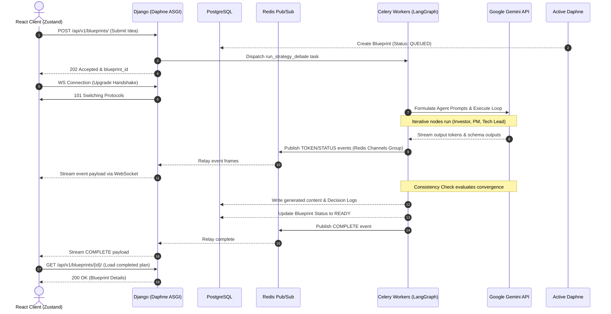

# Foundry — Smart Startup Blueprint Generator

[](https://github.com/vaibhv19/Foundry)
[](https://www.python.org/)
[](https://react.dev/)
[](https://www.docker.com/)
[](https://playwright.dev/)

Foundry is a portfolio-grade, multi-agent AI web application that automatically generates comprehensive business and technical blueprints for startup ideas. The core generation process runs via an asynchronous, multi-agent debate simulation where specialized agent personas negotiate and reach consensus on target market parameters, product specification details, technical architecture choices, and financial budgeting.

---

## 1. Key Architectural Concepts

### 1.1 Multi-Agent Debate Loop
When a user submits a raw startup idea, Foundry launches an asynchronous multi-agent debate orchestrated using LangGraph:
* **Investor (Business Model)**: Analyzes financial viability, market sizing, target customer segmentation, and budget guidelines.
* **Product Manager (Product Specification)**: Designs user journeys, details product features, and lists subscription tiers.
* **Tech Lead (Technical Architecture)**: Formulates system architecture designs, selects technology stacks, databases, and structural models.
* **Consistency Check (Guardrail)**: Evaluates state changes, detects conflicts between new proposals and established decisions, and flags errors.
* **Tie Breaker (Consensus Resolver)**: Resolves persistent disagreements when agents are stuck.

### 1.2 Decision Memory Engine
Foundry preserves the active design state in a persistent DB-backed Decision Log. When subsequent section rewrites are triggered, the agents must comply with previously agreed decisions. If a user requests a rewrite that directly violates a locked decision (e.g. changing DB to MongoDB when PostgreSQL was locked as a P0 decision), the system flags a **Consistency Conflict** and prompts the user to enter a rationale to proceed with a manual override.

---

## 2. Overall System Flow

The following diagram illustrates how synchronous REST requests, asynchronous Celery workers, Redis pub/sub channel layers, and stateful WebSocket connections coordinate to run the multi-agent debate:



---

## 3. Monorepo Layout

```text
Foundry/
├── README.md                      # Project Root README
├── docker-compose.yml             # Docker Orchestration Configuration
├── e2e/                           # Playwright End-to-End Test Suite
│   ├── playwright.config.js       # Playwright Config
│   ├── specs/                     # E2E Spec Scenarios
│   │   ├── initial_generation.spec.js
│   │   ├── conflict_resolution.spec.js
│   │   └── version_rollback.spec.js
│   └── scripts/                   # Load and stress test scripts
│       └── rate_limit_test.py
├── backend/                       # Django + Channels + Celery Backend
│   ├── manage.py                  # Django CLI entrypoint
│   ├── foundry_backend/           # Settings, WS routing, ASGI/WSGI
│   │   ├── ai_engine/             # LLM service provider abstractions
│   │   ├── decision_memory/       # Decision log, extraction, and graph traversal
│   │   └── strategy_room/         # LangGraph agents debate nodes, tasks, consumers
│   ├── users/                     # Users, auth, tier rate limiting
│   └── blueprints/                # Blueprints model, canvas sections, exports
├── frontend/                      # React + Vite Frontend
│   ├── src/                       # React Components & Zustand stores
│   │   ├── api/                   # Axios client & WebSocket managers
│   │   ├── components/            # Layouts, Strategy debate streaming, Canvas grids
│   │   └── store/                 # Zustand state stores (auth, strategy, canvas)
│   └── index.html                 # Frontend index
└── Docs/                          # Comprehensive Technical Deep-Dives
    ├── README.md                  # Documentation Hub Index
    ├── UI_Design.md               # Visual Identity and Theme documentation
    └── Learning/                  # Living Knowledge Base Deep-Dives
        ├── README.md              # Master Table of Contents
        └── ...                    # Topic-specific architectural logs
```

---

## 4. Technical Documentation Hub

Foundry maintains comprehensive, detailed engineering documentation and architectural deep-dives. Refer to the files listed below for specific implementations:

### Core Specifications
* **[Product Requirements Document (Docs/PRD.md)](file:///d:/Coding/Projects----For%20Resume/Foundry/Docs/PRD.md)**: Product goals, target audience, core features list, and design requirements.
* **[Application User Flow (Docs/App_Flow.md)](file:///d:/Coding/Projects----For%20Resume/Foundry/Docs/App_Flow.md)**: Visual mapping of registration, generation, revisions, overrides, and exports.
* **[Technical Stack (Docs/Tech_Stack.md)](file:///d:/Coding/Projects----For%20Resume/Foundry/Docs/Tech_Stack.md)**: Detailed rationales behind auth, caching, DB, and canvas UI selections.
* **[Database Schema (Docs/DB_Schema.md)](file:///d:/Coding/Projects----For%20Resume/Foundry/Docs/DB_Schema.md)**: Relational schema diagram, tables structures, and fields descriptions.

### System & AI Architectures
* **[LangGraph Agent Runtime (Docs/Agent_Runtime.md)](file:///d:/Coding/Projects----For%20Resume/Foundry/Docs/Agent_Runtime.md)**: Graph nodes, transitions, state management, and Celery integrations.
* **[AI Prompt Architecture (Docs/Prompt_Architecture.md)](file:///d:/Coding/Projects----For%20Resume/Foundry/Docs/Prompt_Architecture.md)**: System instruction prompts templates for persona nodes.
* **[Decision Memory Architecture (Docs/Decision_Memory_Architecture.md)](file:///d:/Coding/Projects----For%20Resume/Foundry/Docs/Decision_Memory_Architecture.md)**: Relational constraint tracking, validation rules, and cascading overrides.
* **[REST API Specification (Docs/API_Specification.md)](file:///d:/Coding/Projects----For%20Resume/Foundry/Docs/API_Specification.md)**: REST endpoints definitions.
* **[WebSocket Channels Protocol (Docs/WebSocket_Protocol.md)](file:///d:/Coding/Projects----For%20Resume/Foundry/Docs/WebSocket_Protocol.md)**: Real-time event packet schemas.
* **[Error Handling & Exceptions (Docs/Error_Handling.md)](file:///d:/Coding/Projects----For%20Resume/Foundry/Docs/Error_Handling.md)**: Application error codes and retry logic.
* **[Section Version Control (Docs/Versioning.md)](file:///d:/Coding/Projects----For%20Resume/Foundry/Docs/Versioning.md)**: Rollbacks and section restores.

---

## 5. Local Launch Instructions (Docker Compose)

The entire application runs under a Docker Compose network containing Django (Daphne ASGI), Celery background workers, Redis caches, and a React (Vite) server.

### Prerequisites
* Install [Docker Desktop](https://www.docker.com/products/docker-desktop/) on your system.
* A valid Gemini API Key (or the provider will fallback to the local mock mode automatically).

### Step-by-Step Start
1. **Initialize Environment Variables**:
   Copy the backend environment file and configure your API key:
   ```bash
   cp backend/.env.example backend/.env
   ```
   *(Ensure `GEMINI_API_KEY` is set to your Gemini API Key. If empty or a placeholder prefix like `AQ.`, the system runs in mock mode for offline testing).*

2. **Launch Containers**:
   Build and start the container stack:
   ```bash
   docker-compose up --build
   ```

3. **Verify Access**:
   Once the build completes and services are ready, navigate to:
   * **Frontend Application**: [http://localhost:5173](http://localhost:5173)
   * **Backend REST API**: [http://localhost:8000/api/v1/](http://localhost:8000/api/v1/)

---

## 6. Local Development (Native Virtualenv)

If running without Docker, ensure you have Redis installed and running on `127.0.0.1:6379`.

### 6.1 Backend Server Setup
```bash
cd backend
python -m venv venv
source venv/bin/activate  # On Windows use: venv\Scripts\activate
pip install -r requirements.txt
python manage.py migrate
python manage.py runserver 0.0.0.0:8000
```

### 6.2 Celery Workers Setup
In a new terminal:
```bash
cd backend
source venv/bin/activate  # On Windows use: venv\Scripts\activate
# For Windows developers (requires threads/solo pool overrides):
celery -A foundry_backend worker --loglevel=info -P threads
# For Linux/macOS developers:
celery -A foundry_backend worker --loglevel=info
```

### 6.3 Frontend Dev Server Setup
In a new terminal:
```bash
cd frontend
npm install
npm run dev
```

---

## 7. Testing Strategy

Foundry maintains rigorous test coverage spanning backend unit validations, integration tests, and E2E browser tests.

### 7.1 Backend Unit & Integration Tests (Pytest)
Tests are executed using `pytest` combined with `pytest-django` against the backend container:
```bash
# Run pytest suite inside backend container
docker-compose exec backend pytest
```

### 7.2 End-to-End Integration Tests (Playwright)
The E2E test suite simulates user interactions in virtual browsers:
```bash
cd e2e
npm install
# Run Playwright test suite
npx playwright test
```
The test suite validates:
1. **Initial Generation**: User registration, submitting a startup idea, and observing websocket streaming updates.
2. **Conflict surfacing**: Modifying technical parameters to trigger conflicts and submitting manual overrides.
3. **Rollback control**: Creating section version edits and executing rollbacks.
